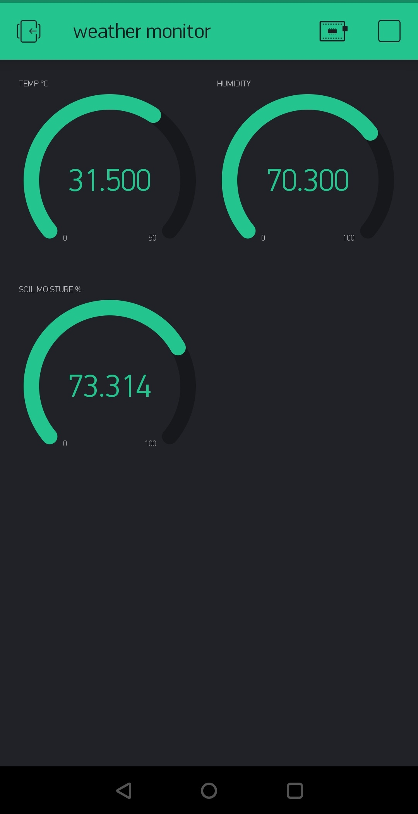

# esp8266_iot_blynk

After cloning this repository you would be able to monitor the weather vitals of the place where you have setup this IOT device,
from anywhere around the world on your Android/IOS device.

We can built our own IOT platform using NodeMCU ESP8266 module and Blynk application interface.

For complete information regarding this project, please visit: https://hakersparadise.blogspot.com/2019/09/esp8266-iot-sensing-with-blynk.html

## Screenshot of the App dashboard

